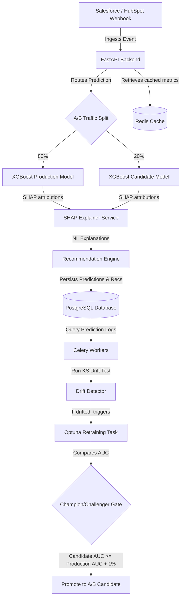

# CRM AI Sales Intelligence System

A production-grade, closed-loop AI-driven CRM Sales Intelligence platform. This system utilizes a leak-free XGBoost model to predict sales deal outcomes, uses SHAP explainability to generate human-readable win/loss reasons, employs an LSTM model to forecast deal close cycles, integrates via Salesforce/HubSpot webhooks, and runs an autonomous retraining loop with Kolmogorov-Smirnov drift detection.

---

## 🚀 Key Features

* **Leak-free ML Pipeline**: Robust temporal train/test split. Advanced feature engineering containing an `AgentPerformanceAggregator` transformer that prevents data leakage by calculating historical win rates strictly up to the interaction date.
* **XGBoost Outcome Predictor**: Predicts win/loss probability with 62% honest accuracy and an AUC of 0.648.
* **LSTM Sales Cycle Forecaster**: Predicts the remaining days to close a deal based on sequence dynamics with an 18-day Mean Absolute Error (MAE).
* **SHAP Explainability**: Translates raw feature attributions into natural language rationales (e.g., *"This deal is highly likely to win due to the agent's strong historical win rate"*).
* **Agentic Recommendation Engine**: Generates urgency-weighted action items categorized into contiguous priority bands (`CRITICAL`, `HIGH`, `MEDIUM`, `LOW`) to help sales agents close deals.
* **CRM Webhook Handler**: Salesforce and HubSpot webhook receiver featuring HMAC validation and a pipeline event simulator.
* **Closed-loop Retraining & Drift Monitoring**: Background workers running via Celery & Redis to calculate Kolmogorov-Smirnov (KS) statistics on incoming production distributions, auto-triggering retraining if drift is detected.
* **A/B Model Routing**: Dynamically directs 20% of traffic to candidate models to evaluate performance live before promotion.
* **React Administrative Dashboard**: Sleek interface displaying pipeline KPIs, SHAP waterfall charts, recommendation feeds, and model governance controls (retrain triggers, performance histories, A/B test promotions).

---

## 🛠️ Architecture Overview

The system is designed with a service-oriented, containerized architecture:



---

## 📂 Project Structure

```
├── alembic/                # Database migrations
├── app/
│   ├── models/            # SQLAlchemy database models (Opportunity, Prediction, etc.)
│   ├── routers/           # FastAPI routers (auth, admin, predict, recommendations, crm)
│   ├── schemas/           # Pydantic validation schemas
│   ├── services/          # Business logic (prediction, shap, recommendations, retraining)
│   └── main.py            # API Gateway entrypoint
├── ml/
│   ├── tasks/             # Celery background tasks (drift, retrain, promote)
│   ├── pipeline.py        # Leak-free sklearn training pipeline
│   ├── train.py           # XGBoost training script with Optuna HPO
│   └── train_problem2_lstm.py # LSTM sequence training script
├── frontend/              # React (Vite + TypeScript + TailwindCSS) admin dashboard
├── nginx/                 # Reverse proxy configuration
├── docker-compose.yml     # Multi-container orchestration (api, db, redis, worker, beat, nginx)
└── requirements.txt       # Python dependencies
```

---

## ⚙️ Quick Start (Local Docker Deployment)

To spin up the entire stack (FastAPI backend, PostgreSQL database, Redis cache, Celery worker, Celery beat, Nginx reverse proxy, and MLflow):

1. **Configure Environment Variables**:
   Copy `.env.example` to `.env` and fill in your secrets:
   ```bash
   cp .env.example .env
   ```

2. **Launch the Container Stack**:
   ```bash
   docker-compose up --build -d
   ```

3. **Verify Health**:
   Run the verification suite to ensure all 6 services are healthy and running:
   ```powershell
   ./run_verifications.ps1
   ```

4. **Access UI Dashboard**:
   * API Gateway: `http://localhost/api/docs`
   * Frontend Admin Panel: `http://localhost:5173` (Runs locally in dev mode or deployed on Vercel)
   * MLflow Server: `http://localhost:5000`

---

## 📈 Model Governance & Retraining

* **Drift Detection**: The system calculates a Kolmogorov-Smirnov (KS) test comparing the production distribution of features (e.g. `num__agent_win_rate`) against the baseline training distribution. If $\ge 3$ features report a p-value $< 0.05$, a retraining job is queued.
* **Automatic Promotion**: Retraining searches the hyperparameter space using Optuna. If the candidate model's validation AUC exceeds the current production model's validation AUC by $1\%$ or more, it is automatically deployed to a 20% A/B test split.
* **Manual Retrain**: Administrators can trigger retraining immediately from the Admin Dashboard, which queries current database records and executes the retraining process synchronously via Celery.
